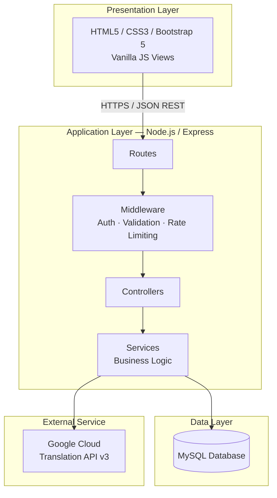
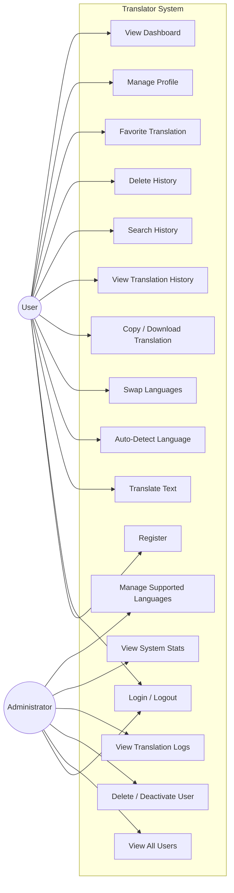
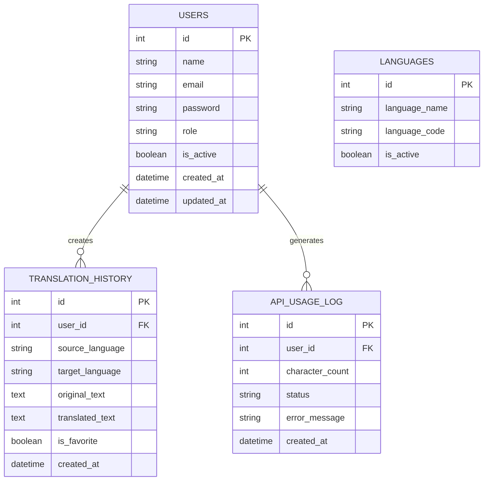
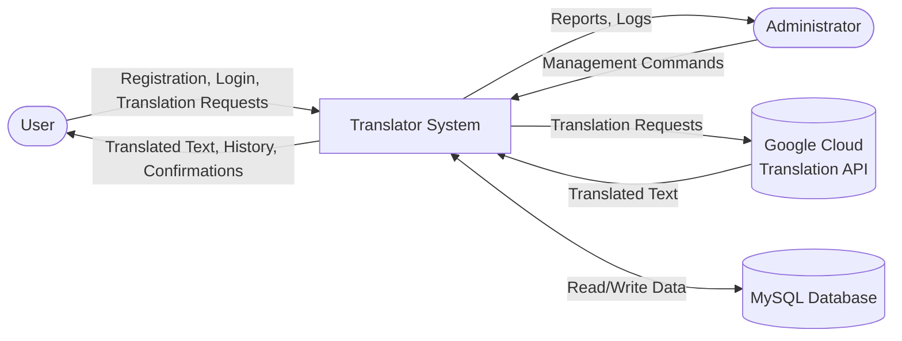
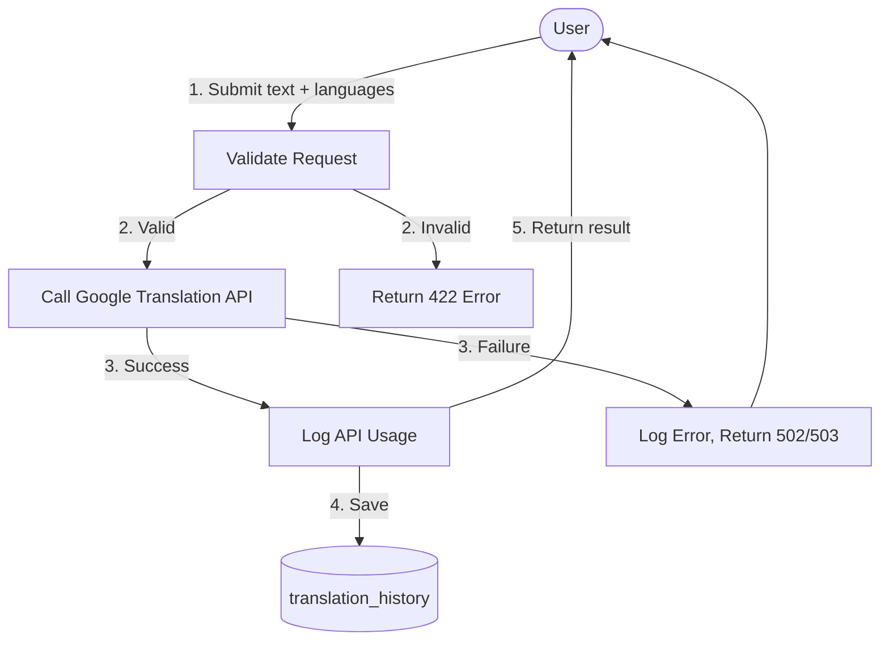
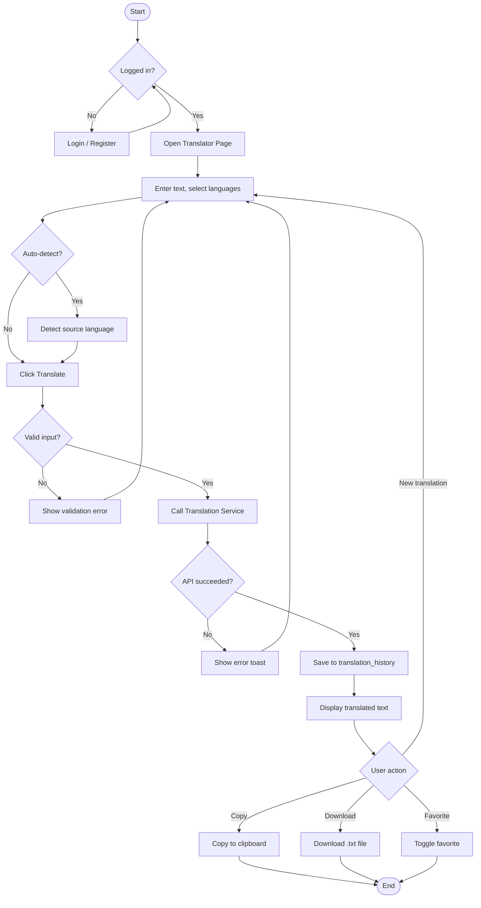
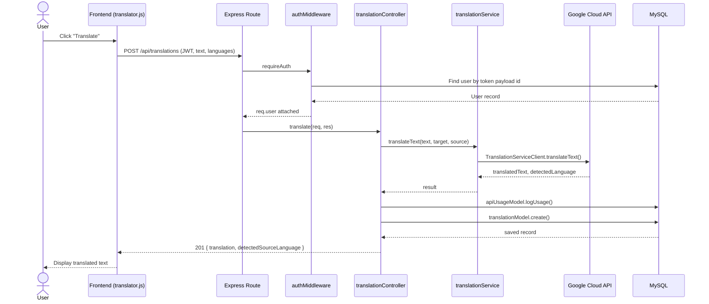
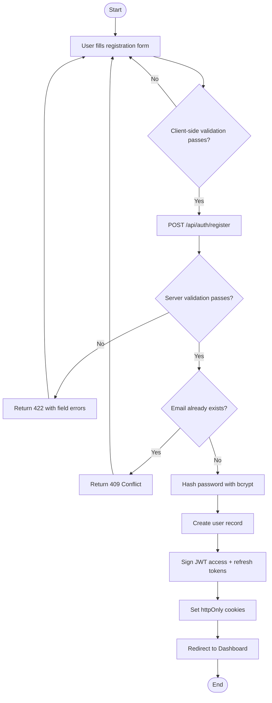
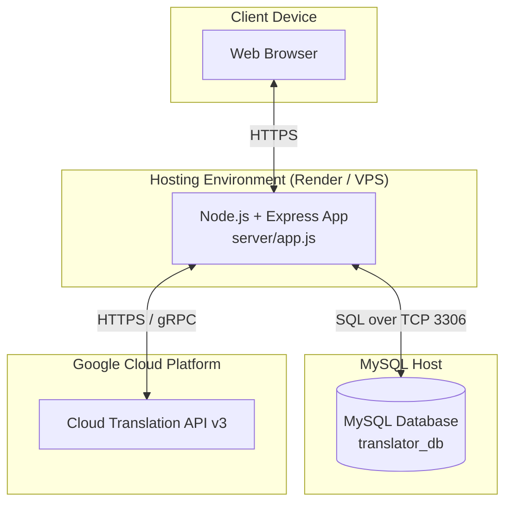

# Software Engineering Diagrams

All diagrams are written in [Mermaid](https://mermaid.js.org/) syntax.
GitHub renders these automatically when viewing this file in a browser. In
VS Code, install the **"Markdown Preview Mermaid Support"** extension (or
just open this file on GitHub) to view them rendered rather than as text.

---

## 1. Software Architecture Diagram

3-tier layered architecture with MVC on the backend.

---

## 2. Use Case Diagram

---

## 3. Entity Relationship Diagram (ERD)

*Note: `LANGUAGES` is intentionally not foreign-keyed to `TRANSLATION_HISTORY`
— it's a lookup/validation table, not a hard dependency (see
`server/database/schema.sql` for the reasoning).*

---

## 4. Data Flow Diagram (DFD) — Level 0 (Context)

## 4b. Data Flow Diagram — Level 1 (Translation Process)

---

## 5. System Flowchart (User Translation Journey)

---

## 6. Sequence Diagram — Translate Text

---

## 7. Activity Diagram — User Registration & Login

---

## 8. Deployment Diagram

---

## 9. Database Schema (visual)

See `server/database/schema.sql` for the authoritative, fully-commented SQL.
The ERD above (section 3) is the visual companion to that script.